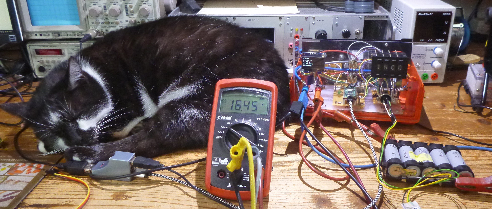
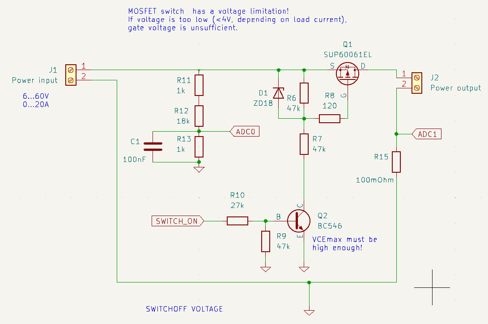
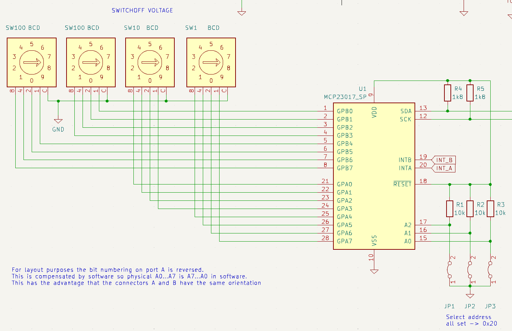

# SOMCA
Switch Off load &amp; Measure Capacity of batteries

This picture shows (from left to right) my assistant Billy, a voltmeter showing battery voltage, SOMCA the device that switches off the load when voltage drops below a threshold adjustable with the BCD switches on the right of the frontplate. The battery on the right in front is connected to the input, a power resistor load is lying on the floor and is not visible here.

SOMCA has the following purposes:

1. switch off the load when voltage drops under the trhreshold, to prevent battery damage
2. measure voltage and current over time
3. from these calculate charge in As and Ah, and energy in Wh
4. store these values for later analysis

In contrast to my other project https://github.com/jean-claudeF/LiIonCapacityMeter that does about the same for single 18650 cells, this is for use with "bigger" batteries like those for electric bicycles or modules from electric cars, like those that i use in my solar energy project.

Limitations:
- voltage must be >= ca. 4V, otherwise the MOSFET will not correctly switch on
- currents up to 10A should be no problem, I have not tested with more

## Switching unit

The switching is done by Q1, a low resistance PMOS transistor.

D1 is a zener diode preventing excessive gate voltages.

Q2 must have a high enough VCEmax, the BC546 it is OK for up to 60V. 

There is a voltage divider providing ADC0 signal, and a shunt R15 providing the ADC1 signal for measuring the current.

  
